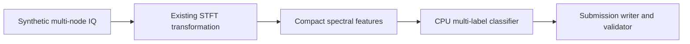

# WAIRC-2026 Architecture

This document describes the current repository as implemented. It is not a
claim that the project already has the future package layout. The installed
`wairc` command is a unified dispatch layer over the existing module entry
points; those `python -m src.<module>` entry points remain supported.

## Data flow

```mermaid
flowchart LR
    A["Training index.csv and IQ NPZ"] --> B["src.data and pandas rows"]
    B --> C["DroneSpectrogramDataset"]
    C --> D["IQ to STFT spectrogram"]
    D --> E["DroneClassifier"]
    E --> F["Training metrics and checkpoints"]
    F --> G["OOF predictions"]
    G --> H["Threshold and rule search"]
    H --> I["Ensemble public-test inference"]
    I --> J["Submission writer and validator"]
```

The data-free demonstration follows a smaller public path:

## Module boundaries

| Module | Current responsibility | Compatibility boundary |
| --- | --- | --- |
| src/config.py | Repository-relative dataset and output paths, class count, seed, validation ratio | NUM_CLASSES, default paths |
| src/data.py | index.csv validation, IQ path resolution, label parsing, multi-hot conversion, split helper | label signature and sample IDs |
| src/spectrogram.py | STFT conversion, cache-backed dataset, model construction, losses, metrics, inference rules | STFT values, model inputs, rule semantics |
| src/train_spectrogram.py | Single-model training, validation metrics, checkpoint/rule outputs, and run manifest | CLI arguments and checkpoint fields |
| src/train_spectrogram_kfold.py | Stratified/K-fold training, per-fold checkpoints/OOF files, and run manifest | fold indices, OOF fields, tag naming |
| src/run_manifest.py | Sanitized `run-manifest-v1` provenance records for training runs | manifest schema and privacy boundary |
| src/checkpoint.py | Versioned model checkpoint metadata and legacy-compatible loading | `checkpoint-v1` fields and loader validation |
| src/dataset_fingerprint.py | Root-independent SHA-256 summaries of normalized index metadata and referenced IQ content | `dataset-fingerprint-v1` schema and privacy boundary |
| src/search_spectrogram_kfold_thresholds.py | Average or weighted OOF probabilities and select an inference rule | OOF file schema and weight semantics |
| src/predict_spectrogram_kfold.py | Load compatible checkpoints, predict public test, apply rule, write submission | checkpoint metadata and sample order |
| src/submission.py | Sort sample IDs and serialize 9-value binary predictions | submission text format |
| src/validate_submission.py | Validate IDs, row count, list shape, and binary values | competition submission contract |
| src/cli.py | Dispatch a unified `wairc` command to existing entry points | existing module entry points remain supported |
| src/synthetic_demo.py | Generate public synthetic IQ and exercise a lightweight CPU workflow | demonstration only; no competition-performance claim |
| archived_baselines/ | Historical nearest-centroid and raw-IQ CNN implementations | retained for historical comparison |
| wairc_rf/ | Stable public transform and label imports over compatible legacy implementations | `stft-v1` behavior and documented public signatures |

## Main workflows

### Training

The single-model entry point reads the labeled index, creates a stratified
train/validation split, computes cached STFT tensors, trains a selected
vision backbone, saves the best checkpoint, and derives an inference rule
from the best validation probabilities.

The k-fold entry point uses StratifiedKFold when possible and falls back to
KFold when class-combination counts are too small. Each fold writes a
checkpoint, history JSON, and OOF NPZ containing probabilities, labels,
original row indices, sample IDs, fold, and the selected metric.

### Rule search and ensemble inference

The rule-search entry point loads OOF files, aligns rows by original index,
averages or weights probabilities, searches global/per-class/top-two rules,
and writes a JSON rule plus OOF probabilities. The prediction entry point
groups checkpoints by their STFT metadata, predicts the public index in stable
order, applies the selected rule, and delegates serialization to the
submission module.

### Validation

The validator reads the public test index and checks that the submission has
the expected IDs, one row per sample unless partial mode is explicitly
requested, exactly nine values per prediction, and only integer 0/1 values.

## Current engineering gaps

- Core STFT, dataset, model, training, and inference logic still lives in a
  small set of script-oriented modules.
- There is no unified experiment configuration file; the CLI currently
  dispatches to the existing script arguments.
- Training outputs now include a sanitized `run-manifest-v1` record with
  selected environment and Git provenance, a `dataset-fingerprint-v1` summary,
  and model checkpoints carrying the `checkpoint-v1` metadata envelope.
  Richer artifact linkage and unified OOF/rule/cache schemas remain follow-up
  work.
- Full-data training and public-test inference require competition data and
  are not part of CI.
- Competition data and trained checkpoints are outside the repository's MIT
  software license and require separate access and terms.

These gaps are tracked as follow-up work rather than being hidden by a new
directory layout.
