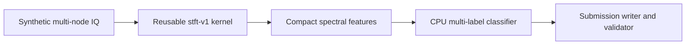

# WAIRC-2026 Architecture

This document describes the current repository as implemented. It is not a
claim that the project already has the future package layout. The installed
`wairc` command is a unified dispatch layer over the existing module entry
points; those `python -m src.<module>` entry points remain supported.

## Data flow

```mermaid
flowchart LR
    A["Training index.csv and IQ NPZ"] --> B["src.data or CompetitionDatasetAdapter"]
    B --> C["DroneSpectrogramDataset"]
    C --> D["IQ to STFT spectrogram"]
    D --> E["DroneClassifier"]
    E --> F["Training metrics and checkpoints"]
    F --> G["OOF predictions"]
    G --> H["Threshold and rule search"]
    H --> I["Ensemble public-test inference"]
    I --> J["Submission writer and validator"]
```

The data-free demonstration follows a smaller public path:

## Module boundaries

| Module | Current responsibility | Compatibility boundary |
| --- | --- | --- |
| src/config.py | Repository-relative dataset and output paths, class count, seed, validation ratio | NUM_CLASSES, default paths |
| src/data.py | index.csv validation, IQ path resolution, label parsing, multi-hot conversion, split helper | label signature and sample IDs |
| src/spectrogram.py | Legacy STFT wrapper, cache-backed dataset, model construction, losses, metrics, inference rules | STFT wrapper behavior, model inputs, rule semantics |
| src/train_spectrogram.py | Single-model training, validation metrics, checkpoint/rule outputs, and run manifest | CLI arguments and checkpoint fields |
| src/train_spectrogram_kfold.py | Stratified/K-fold training, per-fold checkpoints/OOF files, and run manifest | fold indices, OOF fields, tag naming |
| src/run_manifest.py | Sanitized `run-manifest-v1` provenance records for training runs | manifest schema and privacy boundary |
| src/artifact_index.py | Content-addressed references for manifest-declared training artifacts | `artifact-index-v1` schema, output coverage, and path privacy |
| src/checkpoint.py | Versioned model checkpoint metadata and legacy-compatible loading | `checkpoint-v1` fields and loader validation |
| src/dataset_fingerprint.py | Root-independent SHA-256 summaries of normalized index metadata and referenced IQ content | `dataset-fingerprint-v1` schema and privacy boundary |
| src/oof_artifact.py | Versioned per-fold out-of-fold predictions and legacy-compatible validation | `oof-v1` array and metadata contract |
| src/oof_aggregate_artifact.py | Versioned mean or tag-weighted OOF aggregates produced by rule search | `oof-aggregate-v1` arrays, source filenames, and aggregation metadata |
| src/rule_artifact.py | Versioned inference-rule payloads and legacy-compatible loading | `rule-v1` methods, thresholds, and class count |
| src/cache_artifact.py | Versioned STFT cache metadata and legacy-compatible tensor loading | `cache-v1` transform, shape, and node-mask contract |
| src/artifact_inspect.py | Unified artifact detection, validation, run-manifest linkage checks, and path-redacted summaries | checkpoint/OOF/OOF aggregate/rule/cache/manifest compatibility contracts |
| src/artifact_cli.py | `wairc artifact inspect|validate|validate-run` command dispatch and JSON/human output | machine-readable artifact checks and exit status |
| src/search_spectrogram_kfold_thresholds.py | Validate, average or weight OOF probabilities, select, and write a rule artifact | OOF/rule schemas and weight semantics |
| src/predict_spectrogram_kfold.py | Load compatible checkpoints, predict public test, apply rule, write submission | checkpoint metadata and sample order |
| src/submission.py | Sort sample IDs and serialize 9-value binary predictions | submission text format |
| src/validate_submission.py | Validate IDs, row count, list shape, and binary values | competition submission contract |
| src/cli.py | Dispatch a unified `wairc` command to existing entry points | existing module entry points remain supported |
| src/doctor.py | Report Python, Torch, Torchvision, CUDA availability, and package version without data or training side effects | `doctor-v1` JSON/human output and exit status |
| src/synthetic_demo.py | Generate public synthetic IQ and exercise a lightweight CPU workflow | demonstration only; no competition-performance claim |
| src/cpu_compatibility.py | Data-free public-transform, eager CPU-model, and TorchScript CPU compatibility probe | supported Python/CPU execution boundary |
| src/benchmark.py | Run named synthetic profiles, verify redistributable fixtures, write path-safe manifest/report records, and render Markdown summaries | `benchmark-manifest-v1`, `benchmark-report-v1`, `benchmark-fixture-v1`, synthetic-only metrics |
| archived_baselines/ | Historical nearest-centroid and raw-IQ CNN implementations | retained for historical comparison |
| wairc_rf/_stft.py | Shared numerical `stft-v1` kernel independent of datasets and models | `stft-v1` values and legacy fallback boundary |
| wairc_rf/ | Stable public transform, label, RF sample, and synthetic/competition dataset-adapter imports plus an experimental SigMF metadata/recording adapter | `stft-v1` behavior, label helpers, dataset sample contracts, and explicit SigMF subset |

## Main workflows

### Training

The single-model entry point reads the labeled index, creates a stratified
train/validation split, computes cached STFT tensors, trains a selected
vision backbone, saves the best checkpoint, and derives an inference rule
from the best validation probabilities.

The k-fold entry point uses StratifiedKFold when possible and falls back to
KFold when class-combination counts are too small. Each fold writes a
checkpoint, history JSON, and `oof-v1` NPZ containing probabilities, labels,
original row indices, sample IDs, fold, and the selected metric. The reader
also accepts older unversioned OOF files and validates shapes, ranges, unique
row identities, and cross-file label/sample-ID consistency.

### Rule search and ensemble inference

The rule-search entry point loads OOF files, aligns rows by original index,
averages or weights probabilities, searches global/per-class/top-two rules,
and writes a `rule-v1` JSON rule plus OOF probabilities. The prediction entry point
groups checkpoints by their STFT metadata, predicts the public index in stable
order, applies the selected rule, and delegates serialization to the
submission module. Legacy rule JSON remains readable through the shared loader.

### Validation

The validator reads the public test index and checks that the submission has
the expected IDs, one row per sample unless partial mode is explicitly
requested, exactly nine values per prediction, and only integer 0/1 values.

## Current engineering gaps

- Dataset, model, training, and inference logic still lives in a small set of
  script-oriented modules; the reusable `stft-v1` numerical kernel is now
  isolated in `wairc_rf`.
- The public `RFSample`/`RFNode` contract plus synthetic and competition
  adapters provide an additive interoperability path; the legacy training
  dataset still consumes its existing row/dataframe interface.
- There is no unified experiment configuration file; the CLI currently
  dispatches to the existing script arguments.
- The `cpu-smoke` and `robustness-small` synthetic profiles record their fixed
  generator, transform, training, and evaluation inputs in
  `benchmark-manifest-v1`, then write path-safe `benchmark-report-v1` records
  with deterministic signatures. `wairc benchmark summarize` renders those
  reports into compact Markdown without adding local absolute paths, while
  `wairc benchmark verify-fixture` replays repository-authored parameter
  manifests and checks the generated signature. These remain functional checks
  and do not represent real-data or competition accuracy.
- Training outputs now include a sanitized `run-manifest-v1` record with
  selected environment and Git provenance, a `dataset-fingerprint-v1` summary,
  model checkpoints carrying the `checkpoint-v1` metadata envelope, and
  per-fold `oof-v1` artifacts, `rule-v1` inference rules, and `cache-v1` STFT
  caches. Rule search writes legacy-array-compatible `oof-aggregate-v1`
  probabilities with path-free source and weighting metadata. Newly completed
  manifests optionally embed `artifact-index-v1`
  references for declared checkpoints, OOF files, and rules. The artifact CLI
  validates their linkage, metadata, size, and digest without interpreting
  auxiliary config/history files. Richer metadata production remains
  follow-up work.
- Full-data training and public-test inference require competition data and
  are not part of CI.
- Competition data and trained checkpoints are outside the repository's MIT
  software license and require separate access and terms.

These gaps are tracked as follow-up work rather than being hidden by a new
directory layout.
